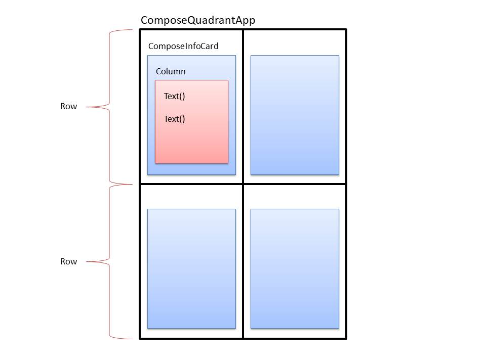
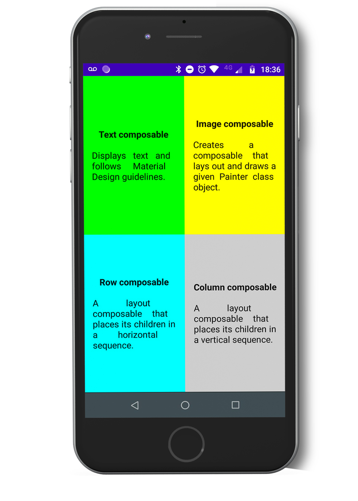

Compose Quadrant App
===================================

Overview
--------------
A simple screen using Jetpack Compose. The screen is divided in quarters.

Layout Structure
--------------

Language 
--------------
Kotlin

Screenshots
--------------

Purpose
--------------
This code demonstrates how I implemented a simple Compose Layout.

Getting Started
---------------
1. Download and run the app.

## Developed By

Patricio Conti
